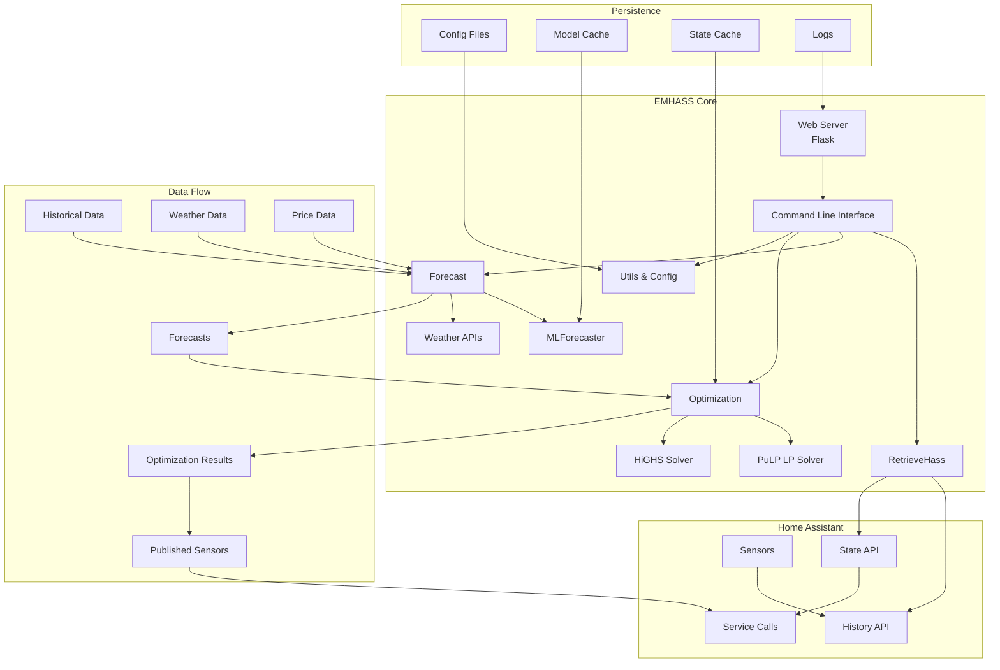
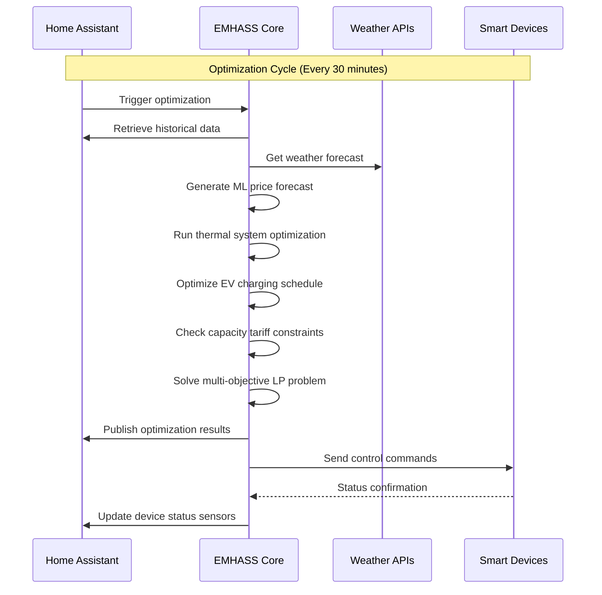
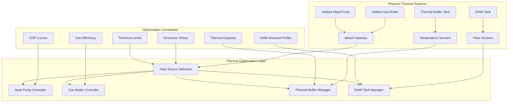

# Architecture for EMHASS (Energy Management for Home Assistant)

Status: Draft

## Technical Summary

EMHASS is a sophisticated energy management system that utilizes Linear Programming optimization to minimize household energy costs while maximizing efficiency and comfort. The current architecture follows a modular, service-oriented design with clear separation of concerns between data retrieval, forecasting, optimization, and control systems.

The architecture is designed to support the evolution from a basic solar/battery optimizer to a comprehensive whole-house energy management platform. The enhanced architecture will support advanced thermal systems (hybrid heating), native electric vehicle charging optimization, capacity tariff management, advanced machine learning-based price forecasting, and seamless Home Assistant integration with real-time device control capabilities.

## Technology Table

| Technology | Description |
|------------|-------------|
| **Core Runtime** | |
| Python 3.10+ | Primary programming language with asyncio support |
| Flask 3.1.0+ | Web framework for REST API and web interface |
| Waitress 3.0.2+ | Production WSGI server for web applications |
| Gunicorn 23.0.0+ | Alternative WSGI server with multi-process support |
| **Optimization Engine** | |
| PuLP 2.8.0+ | Linear Programming modeling framework |
| HiGHS 1.10.0+ | High-performance LP/MIP solver (default) |
| COIN-BC | Alternative open-source LP solver |
| GLPK | GNU Linear Programming Kit |
| **Data Processing** | |
| NumPy 2.0.0+ | Numerical computing and array operations |
| Pandas 2.2.0+ | Data manipulation and time series analysis |
| SciPy 1.15.0+ | Scientific computing and optimization functions |
| **Machine Learning & Forecasting** | |
| scikit-learn | Machine learning algorithms for price forecasting |
| skforecast 0.14.0+ | Time series forecasting with auto-regressive models |
| **Solar & Weather Integration** | |
| PVLib 0.11.0+ | Solar power modeling and irradiance calculations |
| Open-Meteo API | Weather data provider for forecasting |
| Solcast API | Professional solar irradiance forecasting |
| **Home Assistant Integration** | |
| Requests 2.32.2+ | HTTP client for HA REST API communication |
| MQTT (planned) | Real-time device communication protocol |
| **Data Storage & Persistence** | |
| Pickle/cPickle | State persistence and model serialization |
| HDF5/PyTables 3.10.0+ | High-performance data storage |
| YAML 6.0.2+ | Configuration file management |
| JSON | API data exchange and configuration |
| **Visualization & UI** | |
| Plotly 6.0.0+ | Interactive data visualization |
| Jinja2 | HTML template rendering |
| HTML/CSS/JavaScript | Web interface frontend |
| **Device Integration** | |
| ebusd (planned) | Vaillant heating system communication |
| Modbus (planned) | Industrial device communication |
| **Infrastructure** | |
| Docker | Containerization and deployment |
| Home Assistant Add-on | Native HA integration method |
| GitHub Actions | CI/CD pipeline |

## Architectural Diagrams

### Current System Architecture



### Enhanced Architecture for Advanced Features

```mermaid
graph TB
    subgraph "Home Assistant Integration Layer"
        A[HA Sensors] --> B[HA History API]
        C[HA State API] --> D[HA Service Calls]
        E[Device Control] --> F[Automation Engine]
        G[Dashboard Cards] --> H[Frontend UI]
    end
    
    subgraph "EMHASS Core Platform"
        I[Enhanced Web Server] --> J[REST API Router]
        J --> K[Authentication & Security]
        
        subgraph "Data Retrieval & Management"
            L[RetrieveHass Enhanced] --> M[Data Validation]
            N[Configuration Manager] --> O[Multi-Config Support]
            P[State Management] --> Q[Persistent Storage]
        end
        
        subgraph "Advanced Forecasting Engine"
            R[Enhanced Forecast Module] --> S[Weather Integration]
            R --> T[ML Price Forecaster]
            R --> U[Load Forecaster]
            R --> V[Solar Forecaster]
            
            T --> W[Energy Market APIs]
            S --> X[Multiple Weather Providers]
            U --> Y[Pattern Recognition]
            V --> Z[PV Performance Models]
        end
        
        subgraph "Multi-System Optimization Engine"
            AA[Core LP Optimizer] --> BB[Thermal Systems Optimizer]
            AA --> CC[EV Charging Optimizer] 
            AA --> DD[Capacity Tariff Manager]
            AA --> EE[Battery Storage Optimizer]
            
            BB --> FF[Heat Pump Models]
            BB --> GG[Gas Boiler Models]
            BB --> HH[Thermal Storage Models]
            
            CC --> II[SoC Tracking]
            CC --> JJ[Departure Scheduling]
            CC --> KK[Multi-Vehicle Support]
            
            DD --> LL[Peak Demand Tracking]
            DD --> MM[Demand Charge Calculation]
        end
        
        subgraph "Real-Time Device Control Framework"
            NN[Device Controller] --> OO[Protocol Adapters]
            NN --> PP[Safety Interlocks]
            NN --> QQ[Status Monitoring]
            
            OO --> RR[ebusd Integration]
            OO --> SS[MQTT Gateway]
            OO --> TT[HTTP/REST Clients]
            OO --> UU[Modbus Interface]
        end
    end
    
    subgraph "External Systems & Devices"
        VV[Vaillant Heat Pump] --> RR
        WW[Vaillant Gas Boiler] --> RR
        XX[EV Chargers] --> SS
        YY[Smart Appliances] --> TT
        ZZ[Battery Systems] --> UU
    end
    
    subgraph "Data Storage & Caching"
        AAA[Configuration Store] --> N
        BBB[Time Series Cache] --> P
        CCC[Model Persistence] --> T
        DDD[Device State Cache] --> NN
        EEE[Optimization History] --> AA
    end
    
    subgraph "Monitoring & Observability"
        FFF[Performance Metrics] --> I
        GGG[Error Tracking] --> K
        HHH[Audit Logs] --> P
        III[Health Checks] --> NN
    end
```



### Data Flow Architecture



### Thermal System Integration Architecture



## Data Models, API Specs, Schemas, etc...

### Enhanced Configuration Schema

```json
{
  "retrieve_hass_conf": {
    "hass_url": "http://supervisor/core/api",
    "long_lived_token": "auto_detected",
    "time_zone": "Europe/Paris",
    "freq": "PT30M",
    "optimization_time_step": 30,
    "sensor_power_photovoltaics": "sensor.power_photovoltaics",
    "sensor_power_load_no_var_loads": "sensor.power_load_no_var_loads",
    "sensor_price_electricity": "sensor.nordpool_kwh_price",
    "sensor_price_gas": "sensor.gas_price_kwh"
  },
  "optim_conf": {
    "costfun": "profit",
    "delta_forecast_daily": "PT48H",
    "number_of_deferrable_loads": 6,
    "nominal_power_of_deferrable_loads": [12000, 24000, 6000, 6000, 7400, 3000],
    "def_load_config": [
      {
        "load_name": "heat_pump_space_heating",
        "load_type": "thermal_heat_source",
        "thermal_config": {
          "type": "heat_pump_heating",
          "applications": ["space_heating"],
          "efficiency_model": "temperature_dependent_cop",
          "cop_curve": {
            "outdoor_temps": [-15, -10, -5, 0, 2, 7, 15],
            "cop_values": [1.8, 2.0, 2.5, 3.0, 3.5, 4.0, 4.5]
          },
          "capacity_curve": {
            "outdoor_temps": [-15, -10, -5, 0, 2, 7, 15],
            "max_capacities": [2.0, 3.0, 6.0, 8.0, 8.0, 10.0, 12.0]
          },
          "min_outdoor_temp": -15,
          "flow_temp_space_heating": 40
        }
      },
      {
        "load_name": "gas_boiler_space_heating",
        "load_type": "thermal_heat_source", 
        "thermal_config": {
          "type": "gas_boiler_heating",
          "applications": ["space_heating"],
          "efficiency": 0.92,
          "fuel_type": "natural_gas",
          "max_capacity": 24000,
          "min_capacity": 4800,
          "flow_temp_space_heating": 45
        }
      },
      {
        "load_name": "heat_pump_dhw",
        "load_type": "thermal_heat_source",
        "thermal_config": {
          "type": "heat_pump_dhw",
          "applications": ["domestic_hot_water"],
          "efficiency_model": "temperature_dependent_cop",
          "cop_curve": {
            "outdoor_temps": [-15, -10, -5, 0, 2, 7, 15],
            "cop_values": [1.5, 1.8, 2.2, 2.6, 3.0, 3.4, 3.8]
          },
          "max_capacity": 6000,
          "flow_temp_dhw": 55
        }
      },
      {
        "load_name": "gas_boiler_dhw",
        "load_type": "thermal_heat_source",
        "thermal_config": {
          "type": "gas_boiler_dhw",
          "applications": ["domestic_hot_water"],
          "efficiency": 0.92,
          "fuel_type": "natural_gas",
          "max_capacity": 6000,
          "min_capacity": 1200,
          "flow_temp_dhw": 55,
          "priority_over_space_heating": true
        }
      },
      {
        "load_name": "tesla_model_3",
        "load_type": "ev_charging",
        "ev_config": {
          "battery_capacity_kwh": 75,
          "max_charge_rate_kw": 7.4,
          "min_charge_rate_kw": 1.4,
          "charging_efficiency": 0.9,
          "target_soc_percent": 80,
          "min_soc_percent": 20,
          "departure_sensor": "input_datetime.ev_departure_time",
          "plugged_in_sensor": "binary_sensor.tesla_plugged_in",
          "current_soc_sensor": "sensor.tesla_battery_level"
        }
      },
      {
        "load_name": "water_heater",
        "load_type": "traditional_deferrable",
        "power_kw": 3.0,
        "duration_hours": 2,
        "priority": 3,
        "flexibility_hours": 6
      }
    ],
    "thermal_system_config": {
      "enabled": true,
      "space_heating_source": "thermal_buffer",
      "dhw_source": "direct_heat_sources",
      "thermal_buffer": {
        "enabled": true,
        "capacity_kwh": 30,
        "max_charge_rate_kw": 10,
        "max_discharge_rate_kw": 8,
        "efficiency_charge": 0.95,
        "efficiency_discharge": 0.95,
        "standby_loss_rate": 0.002,
        "min_temp": 35,
        "max_temp": 80,
        "initial_temp": 45
      },
      "dhw_tank": {
        "enabled": true,
        "capacity_liters": 300,
        "target_temperature": 55,
        "min_temperature": 45,
        "start_temperature": 50,
        "heat_loss_coefficient": 0.002,
        "demand_profile_sensor": "sensor.dhw_demand_forecast"
      }
    },
    "capacity_tariff_config": {
      "enabled": true,
      "rate_per_kw_per_month": 2.50,
      "measurement_interval_minutes": 15,
      "billing_day_of_month": 1,
      "persistent_state_path": "/data/capacity_tariff_state.json"
    },
    "price_forecasting_config": {
      "enabled": true,
      "electricity_forecast": {
        "model_type": "electricity_price_forecast",
        "sklearn_model": "ElasticNet",
        "num_lags": 168,
        "historic_days": 365,
        "retrain_frequency_days": 7,
        "include_weather_features": true,
        "include_load_features": true
      },
      "gas_forecast": {
        "model_type": "gas_price_forecast",
        "sklearn_model": "LinearRegression",
        "num_lags": 48,
        "historic_days": 365,
        "retrain_frequency_days": 30
      }
    }
  },
  "plant_conf": {
    "set_use_battery": true,
    "battery_nominal_energy_capacity": 10000,
    "battery_maximum_state_of_charge": 0.9,
    "battery_minimum_state_of_charge": 0.1,
    "battery_target_state_of_charge": 0.6,
    "battery_discharge_power_max": 5000,
    "battery_charge_power_max": 5000,
    "battery_discharge_efficiency": 0.95,
    "battery_charge_efficiency": 0.95,
    "set_use_pv": true,
    "pv_module_model": ["CSUN_Eurasia_Energy_Systems_Industry_and_Trade_CSUN295_60M"],
    "pv_inverter_model": ["Fronius_International_GmbH__Fronius_Primo_5_0_1_208_240__240V_"],
    "surface_tilt": [30],
    "surface_azimuth": [205],
    "modules_per_string": [16],
    "strings_per_inverter": [1]
  },
  "device_control_config": {
    "enabled": true,
    "protocols": {
      "ebusd": {
        "enabled": true,
        "base_url": "http://localhost:8888",
        "heat_pump_device": "hp",
        "gas_boiler_device": "bai"
      },
      "mqtt": {
        "enabled": true,
        "broker": "localhost",
        "port": 1883,
        "base_topic": "emhass/control"
      },
      "ha_services": {
        "enabled": true,
        "use_native_services": true
      }
    },
    "safety_config": {
      "enable_interlocks": true,
      "max_temp_override": 85,
      "min_temp_override": 5,
      "fault_detection_enabled": true
    }
  }
}
```

### Optimization Results Schema

```json
{
  "optimization_results": {
    "timestamp": "2024-01-01T00:00:00Z",
    "optimization_period": "PT48H",
    "status": "optimal",
    "solver_time_seconds": 2.45,
    "total_cost_forecast": 15.67,
    "cost_breakdown": {
      "electricity_cost": 12.34,
      "gas_cost": 2.18,
      "capacity_charges": 1.15,
      "carbon_cost": 0.0
    },
    "schedules": {
      "thermal_system": {
        "heat_pump_space_schedule": [8.5, 0.0, 12.0],
        "gas_boiler_space_schedule": [0.0, 15.2, 0.0],
        "heat_pump_dhw_schedule": [3.2, 0.0, 4.1],
        "gas_boiler_dhw_schedule": [0.0, 2.8, 0.0],
        "thermal_buffer_soc": [0.65, 0.72, 0.58],
        "dhw_tank_temperature": [54.5, 56.2, 53.8]
      },
      "ev_charging": {
        "tesla_model_3": {
          "charge_power_schedule": [0.0, 7.4, 3.7, 0.0],
          "soc_schedule": [45.0, 52.1, 57.8, 57.8],
          "departure_ready": true,
          "target_met": true
        }
      },
      "battery_storage": {
        "charge_power_schedule": [2.5, 0.0, -3.8, 1.2],
        "soc_schedule": [0.45, 0.48, 0.42, 0.44]
      },
      "grid_interaction": {
        "import_power_schedule": [2.5, 8.7, 0.0, 4.2],
        "export_power_schedule": [0.0, 0.0, 1.2, 0.0],
        "peak_demand_current": 8.7,
        "peak_demand_monthly": 12.3
      }
    },
    "forecasts_used": {
      "electricity_prices": [0.08, 0.06, 0.12, 0.09],
      "gas_prices": [0.06, 0.06, 0.06, 0.06],
      "outdoor_temperature": [2.5, 1.8, 3.2, 4.1],
      "pv_generation": [0.0, 0.0, 2.1, 4.8],
      "load_forecast": [2.8, 3.2, 2.5, 2.9]
    }
  }
}
```

### Device Control API Schema

```json
{
  "device_control_command": {
    "command_id": "cmd_001_thermal_system",
    "timestamp": "2024-01-01T00:30:00Z",
    "device_type": "thermal_system",
    "target_device": "vaillant_heat_pump",
    "control_method": "ebusd",
    "commands": [
      {
        "topic": "ebusd/hp/ActiveMode/set",
        "payload": "true",
        "confirmation_required": true
      },
      {
        "topic": "ebusd/hp/ThermalDemandSetpoint/set", 
        "payload": "8.5",
        "unit": "kW"
      },
      {
        "topic": "ebusd/hp/FlowTempSetpoint/set",
        "payload": "40",
        "unit": "°C"
      }
    ],
    "safety_constraints": {
      "max_power_limit": 12.0,
      "min_outdoor_temp_check": true,
      "system_fault_check": true
    },
    "expected_response_time": "PT30S",
    "timeout": "PT5M"
  }
}
```

## Project Structure

```text
emhass/
├── src/emhass/
│   ├── __init__.py
│   ├── optimization.py              # Enhanced multi-system optimization engine
│   ├── forecast.py                  # Enhanced forecasting with ML price prediction
│   ├── thermal_systems.py           # NEW: Advanced thermal model & hybrid heating
│   ├── ev_charging.py               # NEW: Native EV charging optimization
│   ├── capacity_tariffs.py          # NEW: Demand charge optimization
│   ├── device_controller.py         # NEW: Real-time device control framework
│   ├── price_forecasting.py         # NEW: ML-based energy price forecasting
│   ├── ha_integration.py            # NEW: Enhanced Home Assistant integration
│   ├── web_server.py                # Enhanced web server with advanced UI
│   ├── retrieve_hass.py             # Enhanced HA data retrieval
│   ├── machine_learning_forecaster.py # Current ML forecasting framework
│   ├── machine_learning_regressor.py  # Current ML regression models
│   ├── command_line.py              # Enhanced CLI with new commands
│   ├── utils.py                     # Enhanced utilities and configuration
│   ├── data/
│   │   ├── config_defaults.json     # Enhanced default configuration
│   │   ├── thermal_models/          # NEW: Thermal system templates
│   │   │   ├── heat_pump_models.json
│   │   │   ├── boiler_models.json
│   │   │   └── thermal_storage_models.json
│   │   ├── ev_models/               # NEW: EV charging templates
│   │   │   ├── tesla_models.json
│   │   │   ├── vw_models.json
│   │   │   └── generic_evse.json
│   │   ├── price_models/            # NEW: Price forecasting model cache
│   │   ├── cec_modules.pbz2         # Solar panel models
│   │   ├── cec_inverters.pbz2       # Solar inverter models
│   │   ├── associations.csv         # Equipment associations
│   │   └── emhass_*.csv             # Equipment databases
│   ├── static/                      # Enhanced web interface assets
│   │   ├── css/
│   │   │   ├── bootstrap.min.css
│   │   │   ├── emhass-theme.css     # NEW: Enhanced styling
│   │   │   └── thermal-viz.css      # NEW: Thermal system visualization
│   │   ├── js/
│   │   │   ├── plotly.min.js
│   │   │   ├── emhass-dashboard.js  # NEW: Enhanced dashboard
│   │   │   ├── setup-wizard.js      # NEW: Guided setup
│   │   │   └── device-control.js    # NEW: Real-time device control
│   │   └── img/
│   │       ├── emhass_logo.png
│   │       ├── thermal_icons/       # NEW: Thermal system icons
│   │       └── ev_icons/            # NEW: EV charging icons
│   └── templates/                   # Enhanced HTML templates
│       ├── index.html               # Enhanced main dashboard
│       ├── configuration.html       # Enhanced configuration interface
│       ├── setup_wizard.html        # NEW: Guided setup wizard
│       ├── thermal_dashboard.html   # NEW: Thermal system monitoring
│       ├── ev_dashboard.html        # NEW: EV charging monitoring
│       ├── price_forecast.html      # NEW: Price forecasting interface
│       └── device_control.html      # NEW: Device control interface
├── tests/
│   ├── test_optimization.py         # Enhanced optimization tests
│   ├── test_forecast.py             # Enhanced forecasting tests
│   ├── test_thermal_systems.py      # NEW: Thermal system tests
│   ├── test_ev_charging.py          # NEW: EV charging tests
│   ├── test_capacity_tariffs.py     # NEW: Capacity tariff tests
│   ├── test_price_forecasting.py    # NEW: Price forecasting tests
│   ├── test_device_controller.py    # NEW: Device control tests
│   ├── test_ha_integration.py       # NEW: HA integration tests
│   ├── test_web_server.py           # Enhanced web server tests
│   ├── test_retrieve_hass.py        # Enhanced HA retrieval tests
│   └── fixtures/                    # Test data and fixtures
│       ├── thermal_test_data.json
│       ├── ev_test_data.json
│       └── price_test_data.json
├── docs/                            # Comprehensive documentation
│   ├── architecture.md              # This document
│   ├── thermal_systems/
│   │   ├── hybrid_heating.md
│   │   ├── thermal_buffer_systems.md
│   │   └── vaillant_integration.md
│   ├── ev_charging/
│   │   ├── ev_optimization.md
│   │   ├── multi_vehicle_support.md
│   │   └── charging_strategies.md
│   ├── price_forecasting/
│   │   ├── ml_price_models.md
│   │   ├── market_integration.md
│   │   └── forecast_accuracy.md
│   ├── capacity_tariffs/
│   │   ├── demand_charge_optimization.md
│   │   └── peak_management.md
│   ├── ha_integration/
│   │   ├── setup_guide.md
│   │   ├── custom_component.md
│   │   └── automation_examples.md
│   ├── device_control/
│   │   ├── ebusd_integration.md
│   │   ├── mqtt_control.md
│   │   └── safety_systems.md
│   └── api/
│       ├── rest_api.md
│       ├── websocket_api.md
│       └── device_protocols.md
├── scripts/                         # Enhanced build and deployment
│   ├── build_docker.sh
│   ├── setup_dev_env.sh
│   ├── run_tests.sh
│   ├── thermal_system_setup.sh      # NEW: Thermal system configuration
│   ├── ev_setup.sh                  # NEW: EV charging setup
│   └── ha_integration_setup.sh      # NEW: HA integration setup
├── .github/workflows/               # Enhanced CI/CD pipelines
│   ├── ci.yml                       # Enhanced continuous integration
│   ├── docker-publish.yml           # Container publishing
│   ├── docs-deploy.yml              # Documentation deployment
│   ├── thermal-tests.yml            # NEW: Thermal system testing
│   ├── ev-tests.yml                 # NEW: EV charging testing
│   └── integration-tests.yml        # NEW: Full integration testing
├── docker/                          # Docker configuration
│   ├── Dockerfile                   # Enhanced container configuration
│   ├── docker-compose.yml           # Development environment
│   ├── docker-compose.prod.yml      # Production environment
│   └── addon/                       # Home Assistant Add-on configuration
│       ├── config.yaml
│       ├── Dockerfile
│       └── run.sh
├── .ai/                             # Architecture and planning documents
│   ├── prd.md                       # Product Requirements Document
│   ├── architecture.md              # This architecture document
│   └── stories/                     # Implementation user stories
├── pyproject.toml                   # Enhanced Python package configuration
├── README.md                        # Enhanced project documentation
├── CONTRIBUTING.md                  # Development guidelines
├── CHANGELOG.md                     # Version history
└── LICENSE                          # MIT License
```

## Infrastructure

### Container Architecture

**Multi-Stage Docker Build:**
- **Base Image**: Python 3.11-slim for minimal footprint
- **Dependencies Stage**: Install system packages and Python dependencies
- **Application Stage**: Copy source code and configure runtime
- **Production Stage**: Minimal runtime with only necessary components

**Resource Requirements:**
- **Minimum**: 1 CPU core, 1GB RAM, 2GB storage
- **Recommended**: 2 CPU cores, 2GB RAM, 5GB storage  
- **Advanced Features**: 4 CPU cores, 4GB RAM, 10GB storage

### Home Assistant Add-on Architecture

**Supervisor Integration:**
- Automatic discovery of HA instance URL and token
- Ingress support for seamless HA UI integration
- Persistent data storage in `/data` volume
- Automatic backup inclusion
- Resource limit management

**Security Model:**
- No host network access required
- Minimal privilege container
- Encrypted communication with HA
- Input validation and sanitization
- Rate limiting on API endpoints

### Scalability Considerations

**Horizontal Scaling:**
- Stateless web service design
- External state persistence
- Load balancer compatible
- Multi-instance deployment support

**Vertical Scaling:**
- Configurable worker processes
- Memory-efficient data structures
- Caching layer for frequent operations
- Asynchronous processing for long-running tasks

## Deployment Plan

### Phase 1: Foundation Enhancement (Months 1-2)
**Epic 1: Core Optimization Engine Enhancement**

1. **Advanced Energy Price Forecasting Implementation**
   - Extend MLForecaster module with price prediction capabilities
   - Add seasonal pattern recognition and weather correlation features
   - Implement confidence interval calculations
   - Add price forecast publishing to Home Assistant
   - **Dependencies**: Current MLForecaster framework
   - **Impact**: Enables 48-hour optimization horizon

2. **Capacity Tariff Optimization Integration**
   - Add persistent state management for peak demand tracking
   - Implement capacity tariff constraints in LP optimization
   - Create monthly billing cycle management
   - Add capacity charge cost calculations
   - **Dependencies**: Core optimization engine
   - **Impact**: Significant cost savings for demand charge customers

3. **Optimization Algorithm Performance Enhancement**
   - Implement forecast data caching mechanisms
   - Optimize LP solver performance with model pre-processing
   - Add parallel processing for complex multi-system scenarios
   - Memory optimization for large-scale configurations
   - **Dependencies**: All optimization components
   - **Impact**: Faster optimization cycles, support for complex scenarios

### Phase 2: Thermal Systems Integration (Months 2-4)
**Epic 2: Advanced Thermal Systems Management**

1. **Advanced Thermal Model Foundation**
   - Implement DHW tank thermal modeling with heat loss calculations
   - Add thermal buffer vat component with stratification modeling
   - Create modular thermal component registration system
   - Support multiple thermal zones and applications
   - **Dependencies**: Enhanced configuration system
   - **Impact**: Foundation for advanced thermal optimization

2. **Hybrid Heating System Integration**
   - Configure heat sources as separate optimization variables
   - Implement temperature-dependent efficiency curves
   - Add technical constraint handling (capacity derating, minimum temps)
   - Create economic optimization with dynamic fuel cost comparison
   - **Dependencies**: Thermal model foundation, price forecasting
   - **Impact**: Intelligent heat source selection based on economics

3. **Real-Time Heat Source Control Integration**
   - Implement ebusd integration for Vaillant heating systems
   - Create optimization-to-device translation logic
   - Add setpoint-based control avoiding direct modulation override
   - Support coordinated multi-system operation
   - **Dependencies**: Device control framework, optimization results
   - **Impact**: Seamless integration with existing heating systems

### Phase 3: Smart Load Management (Months 3-5)
**Epic 3: Smart Load Management and EV Integration**

1. **Native Electric Vehicle Charging Component**
   - Implement EV battery SoC tracking and constraints
   - Add departure time constraint handling in LP optimization
   - Create variable charging rate optimization
   - Support charging efficiency modeling
   - **Dependencies**: Core optimization engine
   - **Impact**: Native EV charging optimization replacing generic loads

2. **Advanced EV Charging Strategies**
   - Implement smart charging with PV self-consumption prioritization
   - Add multi-day planning for adaptive SoC targeting
   - Create time-of-use tariff optimization
   - Support multiple EV household configurations
   - **Dependencies**: EV charging component, price forecasting
   - **Impact**: Sophisticated EV charging strategies

3. **Integrated Load Management Coordination**
   - Coordinate EV charging with thermal systems and battery storage
   - Implement priority-based load scheduling
   - Add conflict resolution for competing loads
   - Create load balancing for capacity-constrained systems
   - **Dependencies**: All load optimization components
   - **Impact**: Holistic household energy management

### Phase 4: System Integration & UX (Months 4-6)
**Epic 4: System Integration and User Experience**

1. **Enhanced Home Assistant Integration**
   - Implement automatic sensor discovery and configuration suggestions
   - Create guided setup wizard with step-by-step configuration
   - Add native HA service calls replacing REST API dependencies
   - Develop custom dashboard cards for EMHASS status and control
   - **Dependencies**: All core functionality
   - **Impact**: Dramatically improved user experience

2. **Real-Time Device Control Framework**
   - Create generic device controller for automatic appliance control
   - Implement MQTT integration for IoT device communication
   - Add Home Assistant automation generation
   - Support multiple control protocols (HTTP, MQTT, Modbus)
   - **Dependencies**: Device-specific integrations
   - **Impact**: Universal device control capabilities

3. **Advanced Visualization and Monitoring**
   - Implement advanced energy flow visualization
   - Add cost analysis and savings reporting
   - Create forecast accuracy monitoring and model performance metrics
   - Support mobile-responsive web interface design
   - **Dependencies**: All optimization results
   - **Impact**: Professional monitoring and analysis capabilities

## Security Architecture

### Authentication & Authorization
- **Home Assistant Integration**: Leverages HA's authentication system
- **API Security**: Bearer token authentication for REST API access
- **Local Access**: Network-based access control for container deployment
- **Input Validation**: Comprehensive validation of all user inputs and API parameters

### Data Protection
- **Encryption in Transit**: HTTPS/TLS for all web communication
- **Encryption at Rest**: Sensitive configuration data encryption
- **Data Minimization**: Only necessary data retention
- **Privacy Compliance**: GDPR-compliant data handling practices

### System Security
- **Container Security**: Non-root container execution, minimal attack surface
- **Dependency Management**: Regular security updates and vulnerability scanning
- **Network Isolation**: Minimal network permissions and firewall rules
- **Audit Logging**: Comprehensive audit trail for security events

## Scalability & Performance

### Performance Optimization
- **Caching Strategy**: Multi-layer caching for forecasts, models, and results
- **Database Optimization**: Efficient data structures and indexing
- **Memory Management**: Careful memory allocation and garbage collection
- **CPU Optimization**: Parallel processing for independent optimization tasks

### Monitoring & Observability
- **Performance Metrics**: Response times, optimization duration, memory usage
- **Error Tracking**: Comprehensive error logging and alerting
- **Health Checks**: Automated system health monitoring
- **Capacity Planning**: Resource usage trending and forecasting

## Change Log

| Change | Epic | Story | Description |
|--------|------|-------|-------------|
| Initial architecture draft | N/A | N/A | Comprehensive architecture document for EMHASS v2.0 |
| Enhanced thermal systems | Epic 2 | All | Advanced thermal modeling and hybrid heating integration |
| Native EV charging | Epic 3 | Story 1-2 | Native electric vehicle charging optimization |
| Price forecasting ML | Epic 1 | Story 1 | Machine learning-based energy price forecasting |
| Real-time device control | Epic 4 | Story 2 | Generic device control framework with protocol support |
| Capacity tariff optimization | Epic 1 | Story 2 | Demand charge optimization and peak management |
| Enhanced HA integration | Epic 4 | Story 1 | Improved Home Assistant integration and user experience | 