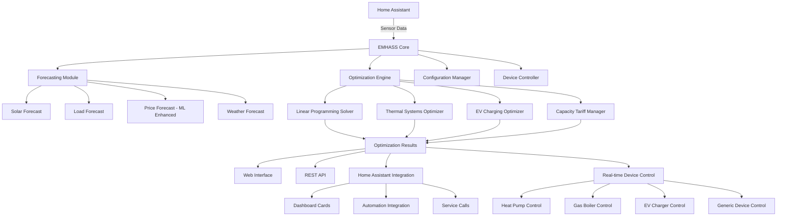

# 1. Title: PRD for EMHASS (Energy Management for Home Assistant)

<version>2.0.0</version>

## Status: Draft

## Intro

EMHASS (Energy Management for Home Assistant) is a Python module designed to optimize home energy usage by interfacing with Home Assistant. The system uses Linear Programming optimization to minimize energy costs while considering factors such as electricity prices, solar panel generation, battery storage, and controllable loads. This PRD outlines the continued development and enhancement of EMHASS to provide a more robust, scalable, and user-friendly energy management solution for residential households.

The project aims to help households reduce energy costs, increase efficiency, and promote sustainable energy usage through intelligent optimization and automation of energy-consuming devices including advanced thermal systems, electric vehicle charging, and sophisticated energy market participation.

## Goals

- Provide optimal energy scheduling for households with solar panels, batteries, and controllable loads
- Minimize energy costs through intelligent load shifting and energy arbitrage
- Maximize self-consumption of renewable energy generation
- Support advanced thermal systems including hybrid heating (heat pump + gas boiler) and thermal storage
- Enable native electric vehicle charging optimization with departure scheduling
- Integrate capacity tariff optimization for demand charge management
- Provide advanced energy price forecasting beyond day-ahead market availability
- Integrate seamlessly with Home Assistant for automation and control
- Support multiple installation methods (Add-on, Docker, Python package)
- Maintain high configurability to adapt to diverse household setups
- Deliver real-time optimization with forecasting capabilities
- Achieve energy cost savings of 20-40% for typical households
- Support sustainable energy practices and grid stability

## Features and Requirements

### Functional Requirements
- Linear Programming optimization engine for energy scheduling
- Solar PV generation forecasting and integration
- Battery storage optimization (charge/discharge scheduling)
- Advanced thermal system management (heat pumps, gas boilers, thermal buffers, DHW tanks)
- Native electric vehicle charging optimization with SoC tracking
- Capacity tariff optimization for demand charge management
- Advanced energy price forecasting using machine learning
- Controllable load management and deferrable load optimization
- Integration with Home Assistant sensors and entities
- Real-time and day-ahead optimization capabilities
- Multi-tariff electricity pricing support
- Web-based configuration interface
- RESTful API for automation and integration
- Data persistence and historical analysis
- Real-time device control integration (ebusd, MQTT, etc.)

### Non-functional Requirements
- Response time: < 5 seconds for optimization calculations
- Availability: 99.5% uptime for energy management decisions
- Scalability: Support households with up to 50 controllable devices
- Compatibility: Python 3.8+ and Home Assistant 2023.1+
- Memory usage: < 1GB RAM for complex household configurations with full feature set
- Documentation: Comprehensive user and developer documentation
- Forecast accuracy: <15% MAPE for 48-hour energy price forecasts
- Thermal comfort: Maintain temperature within ±1°C of setpoints

### User Experience Requirements
- Intuitive web interface for configuration and monitoring
- Clear visualization of energy flows and optimization results
- Simple installation process across multiple platforms
- Comprehensive configuration validation and error reporting
- Real-time status indicators and performance metrics
- Native Home Assistant dashboard integration
- Guided setup wizard for complex configurations

### Integration Requirements
- Home Assistant Add-on compatibility
- Docker container deployment
- RESTful API for third-party integrations
- MQTT support for IoT device communication
- Integration with popular energy monitoring systems
- ebusd integration for Vaillant heating systems
- Support for popular HA integrations (Nordpool, Solcast, etc.)

### Compliance Requirements
- Open source licensing (MIT License)
- Energy market regulations compliance
- Data privacy and security standards
- Home automation safety standards

## Epic List

### Epic-1: Core Optimization Engine Enhancement
Status: InProgress
- Advanced energy price forecasting beyond day-ahead availability
- Capacity tariff optimization for demand charges
- Multi-objective optimization improvements
- Performance optimization and scalability

### Epic-2: Advanced Thermal Systems Management
Status: ''
- Enhanced thermal model with DHW tanks and thermal buffers  
- Hybrid heating optimization (heat pump + gas boiler)
- Heat source selection with real-time device control
- Thermal storage optimization strategies

### Epic-3: Smart Load Management and EV Integration
Status: ''
- Native electric vehicle charging optimization
- Advanced deferrable load coordination
- Multi-load priority management
- Smart charging with departure scheduling

### Epic-4: System Integration and User Experience
Status: ''
- Enhanced Home Assistant integration (custom component path)
- Real-time device control and automation
- Advanced visualization and reporting
- Mobile-responsive interface and dashboard integration

### Epic-N: Future Advanced Features (Beyond Scope of current PRD)
- Machine learning optimization with reinforcement learning
- Grid services and demand response participation
- Multi-home energy community features
- V2G (Vehicle-to-Grid) integration

## Epic 1: Story List

- Story 1: Advanced Energy Price Forecasting Implementation
  Status: ''
  Requirements:
  - Extend MLForecaster to predict electricity prices beyond day-ahead availability
  - Support 48-hour price forecasts using historical data and weather correlations
  - Integrate seasonal patterns and calendar effects for accurate price modeling
  - Add confidence intervals and uncertainty quantification for risk management
  - Create price forecast sensors for Home Assistant integration

- Story 2: Capacity Tariff Optimization Integration
  Status: ''
  Requirements:
  - Add capacity tariff tracking and peak demand monitoring
  - Implement incremental cost calculations for demand charges
  - Create persistent state management for monthly peak tracking
  - Add capacity tariff constraints to optimization model
  - Support configurable measurement intervals (15min, 30min, 1hour)

- Story 3: Optimization Algorithm Performance Enhancement
  Status: ''
  Requirements:
  - Implement caching mechanisms for forecast data
  - Optimize Linear Programming solver performance for complex models
  - Add parallel processing for multiple optimization scenarios
  - Benchmark and profile optimization execution times with advanced features
  - Memory optimization for large-scale household configurations

## Epic 2: Story List

- Story 1: Advanced Thermal Model Foundation
  Status: ''
  Requirements:
  - Implement domestic hot water (DHW) tank thermal modeling
  - Add thermal buffer vat component with stratification modeling
  - Create modular thermal component registration system
  - Support multiple thermal zones and applications
  - Add thermal storage state tracking and constraints

- Story 2: Hybrid Heating System Integration
  Status: ''
  Requirements:
  - Configure heat sources (heat pump + gas boiler) as separate deferrable loads
  - Implement temperature-dependent efficiency curves (COP for heat pumps)
  - Add technical constraint handling (capacity derating, minimum temperatures)
  - Create economic optimization with dynamic fuel cost comparison
  - Support parallel operation coordination for multiple heat sources

- Story 3: Real-Time Heat Source Control Integration
  Status: ''
  Requirements:
  - Implement ebusd integration for Vaillant heating systems
  - Create optimization-to-device translation logic
  - Add setpoint-based control (avoiding direct modulation override)
  - Support coordinated multi-system operation (HP + GB coordination)
  - Add safety interlocks and system fault handling

## Epic 3: Story List

- Story 1: Native Electric Vehicle Charging Component
  Status: ''
  Requirements:
  - Implement EV battery State of Charge (SoC) tracking
  - Add departure time constraint handling
  - Create variable charging rate optimization
  - Support charging efficiency modeling
  - Add EV status integration (plugged in, departure time sensors)

- Story 2: Advanced EV Charging Strategies
  Status: ''
  Requirements:
  - Implement smart charging with PV self-consumption prioritization
  - Add multi-day planning for adaptive SoC targeting
  - Create time-of-use tariff optimization for EV charging
  - Support multiple EV household configurations
  - Add battery health considerations and degradation modeling

- Story 3: Integrated Load Management Coordination
  Status: ''
  Requirements:
  - Coordinate EV charging with thermal systems and battery storage
  - Implement priority-based load scheduling
  - Add conflict resolution for competing loads
  - Create load balancing for capacity-constrained systems
  - Support dynamic priority adjustment based on urgency

## Epic 4: Story List

- Story 1: Enhanced Home Assistant Integration
  Status: ''
  Requirements:
  - Implement automatic sensor discovery and configuration suggestions
  - Create guided setup wizard with step-by-step configuration
  - Add native HA service calls replacing REST API dependencies
  - Develop custom dashboard cards for EMHASS status and control
  - Support popular HA integrations (Nordpool, Solcast, weather services)

- Story 2: Real-Time Device Control Framework
  Status: ''
  Requirements:
  - Create generic device controller for automatic appliance control
  - Implement MQTT integration for IoT device communication
  - Add Home Assistant automation generation for common scenarios
  - Support multiple control protocols (HTTP, MQTT, Modbus, etc.)
  - Create device status feedback and control confirmation

- Story 3: Advanced Visualization and Monitoring
  Status: ''
  Requirements:
  - Implement advanced energy flow visualization
  - Add cost analysis and savings reporting
  - Create forecast accuracy monitoring and model performance metrics
  - Support mobile-responsive web interface design
  - Add historical trend analysis and optimization performance tracking

## Technology Stack

| Technology | Description |
|------------|-------------|
| Python 3.8+ | Primary programming language for optimization engine |
| SciPy/NumPy | Mathematical optimization and numerical computation |
| CVXPY | Convex optimization library for Linear Programming |
| scikit-learn | Machine learning for price forecasting and pattern recognition |
| Flask | Web framework for REST API and web interface |
| Pandas | Data manipulation and analysis |
| SQLite | Local data storage and configuration persistence |
| Docker | Containerization for deployment |
| Home Assistant | Smart home platform integration |
| JavaScript/HTML/CSS | Web interface frontend |
| MQTT | IoT device communication protocol |
| ebusd | Vaillant heating system communication |
| pytest | Testing framework |
| GitHub Actions | CI/CD pipeline |

## Reference



## Data Models, API Specs, Schemas, etc...

### Enhanced Optimization Configuration Schema

```json
{
  "optimization_time_step": "PT30M",
  "forecast_hours": 48,
  "solar_panel_config": {
    "installed_capacity_kw": 5.0,
    "tilt_angle": 30,
    "azimuth_angle": 180,
    "efficiency": 0.2
  },
  "battery_config": {
    "capacity_kwh": 10.0,
    "max_charge_rate_kw": 5.0,
    "max_discharge_rate_kw": 5.0,
    "efficiency": 0.95,
    "min_soc": 0.1,
    "max_soc": 0.9
  },
  "thermal_system_config": {
    "enabled": true,
    "heat_sources": {
      "heat_pump": {
        "enabled": true,
        "max_power_kw": 12.0,
        "cop_curve": {
          "outdoor_temps": [-15, -10, -5, 0, 2, 7, 15],
          "cop_values": [1.8, 2.0, 2.5, 3.0, 3.5, 4.0, 4.5]
        },
        "min_outdoor_temp": -15
      },
      "gas_boiler": {
        "enabled": true,
        "max_power_kw": 24.0,
        "efficiency": 0.92,
        "min_power_kw": 4.8
      }
    },
    "thermal_storage": {
      "dhw_tank": {
        "enabled": true,
        "capacity_liters": 300,
        "target_temperature": 55,
        "min_temperature": 45
      },
      "thermal_buffer": {
        "enabled": true,
        "capacity_kwh": 30,
        "max_charge_rate_kw": 10,
        "max_discharge_rate_kw": 8
      }
    }
  },
  "ev_config": {
    "enabled": true,
    "battery_capacity_kwh": 75,
    "max_charge_rate_kw": 7.4,
    "charging_efficiency": 0.9,
    "target_soc_percent": 80,
    "min_soc_percent": 20
  },
  "capacity_tariff_config": {
    "enabled": true,
    "rate_per_kw_per_month": 2.50,
    "measurement_interval_minutes": 15,
    "billing_day_of_month": 1
  },
  "price_forecasting_config": {
    "enabled": true,
    "electricity_model": "ElasticNet",
    "gas_model": "LinearRegression",
    "historic_days": 365,
    "retrain_frequency_days": 7
  },
  "controllable_loads": [
    {
      "name": "water_heater",
      "power_kw": 3.0,
      "duration_hours": 2,
      "priority": 1,
      "flexibility_hours": 6
    }
  ]
}
```

### EV Charging Schedule Schema

```json
{
  "ev_schedule": {
    "vehicle_id": "tesla_model_3",
    "departure_time": "2024-01-01T07:30:00Z",
    "current_soc_percent": 45,
    "target_soc_percent": 80,
    "charging_plan": [
      {
        "datetime": "2024-01-01T00:00:00Z",
        "charge_power_kw": 0.0,
        "expected_soc_percent": 45.0,
        "electricity_price": 0.08
      },
      {
        "datetime": "2024-01-01T02:00:00Z", 
        "charge_power_kw": 7.4,
        "expected_soc_percent": 55.2,
        "electricity_price": 0.05
      }
    ],
    "cost_analysis": {
      "total_energy_kwh": 26.25,
      "total_cost": 1.89,
      "average_price_per_kwh": 0.072
    }
  }
}
```

### Thermal System Status Schema

```json
{
  "thermal_status": {
    "heat_sources": {
      "heat_pump": {
        "active": true,
        "power_kw": 8.5,
        "thermal_output_kw": 25.5,
        "cop": 3.0,
        "outdoor_temp": 2.5
      },
      "gas_boiler": {
        "active": false,
        "power_kw": 0.0,
        "thermal_output_kw": 0.0,
        "efficiency": 0.92
      }
    },
    "thermal_storage": {
      "dhw_tank": {
        "temperature": 54.5,
        "target_temperature": 55.0,
        "demand_forecast_liters": [15, 25, 10, 5]
      },
      "thermal_buffer": {
        "stored_energy_kwh": 18.5,
        "capacity_kwh": 30.0,
        "charge_rate_kw": 5.2,
        "discharge_rate_kw": 0.0
      }
    }
  }
}
```

## Project Structure

```text
emhass/
├── src/emhass/
│   ├── __init__.py
│   ├── optimization.py          # Enhanced core optimization algorithms
│   ├── forecasting.py           # Solar, load, and price forecasting with ML
│   ├── thermal_systems.py       # Advanced thermal model and hybrid heating
│   ├── ev_charging.py           # Native EV charging optimization component
│   ├── capacity_tariffs.py      # Demand charge optimization
│   ├── device_controller.py     # Real-time device control framework
│   ├── ha_integration.py        # Enhanced Home Assistant integration
│   ├── web_server.py            # Flask web application with advanced UI
│   ├── command_line.py          # CLI interface
│   ├── utils.py                 # Utility functions
│   ├── data/
│   │   ├── config_defaults.json
│   │   ├── thermal_models/      # Thermal system templates
│   │   └── test_data/
│   ├── static/                  # Web interface assets
│   │   ├── css/
│   │   ├── js/
│   │   └── img/
│   └── templates/               # HTML templates with setup wizard
├── tests/
│   ├── test_optimization.py
│   ├── test_forecasting.py
│   ├── test_thermal_systems.py
│   ├── test_ev_charging.py
│   ├── test_capacity_tariffs.py
│   └── test_ha_integration.py
├── docs/                        # Comprehensive documentation
│   ├── hybrid_heating.md
│   ├── ev_charging_optimization.md
│   ├── advanced_thermal_model.md
│   ├── capacity_tariff_optimization.md
│   ├── energy_price_forecasting.md
│   ├── optimizer_heat_source_selection.md
│   └── ha_integration_roadmap.md
├── scripts/                     # Build and deployment scripts
├── .github/workflows/           # CI/CD pipelines
├── pyproject.toml              # Python package configuration
├── Dockerfile                  # Container configuration
└── README.md                   # Project documentation
```

## Change Log

| Change | Story ID | Description |
|--------|----------|-------------|
| Initial PRD draft | N/A | Initial draft PRD for EMHASS project |
| Advanced features integration | N/A | Added thermal systems, EV charging, capacity tariffs, price forecasting, and HA integration roadmap | 